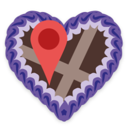
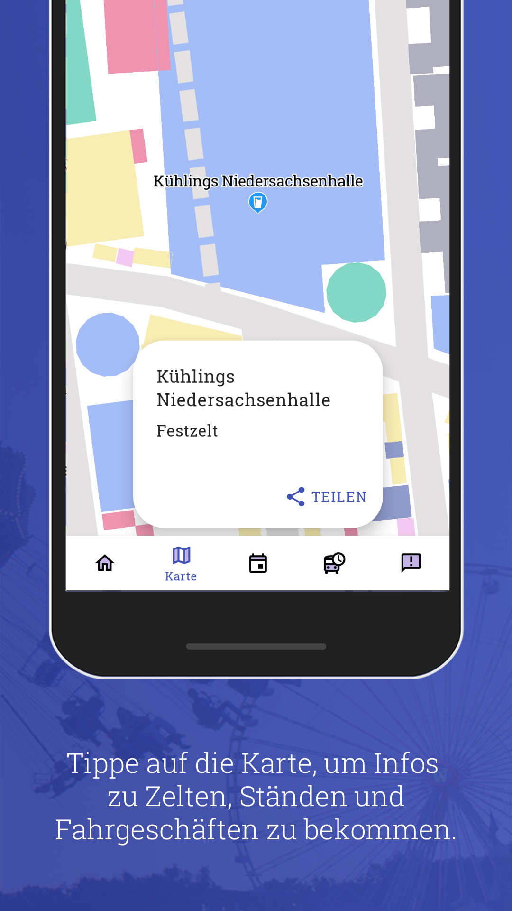
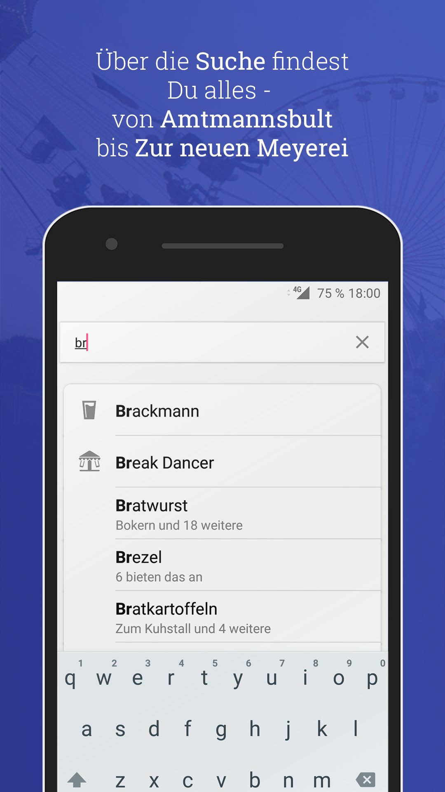
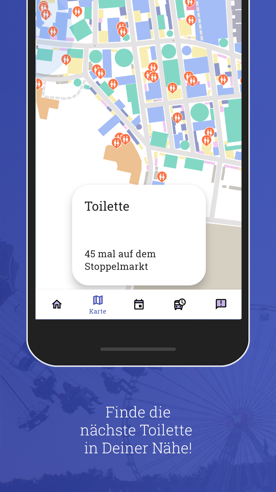
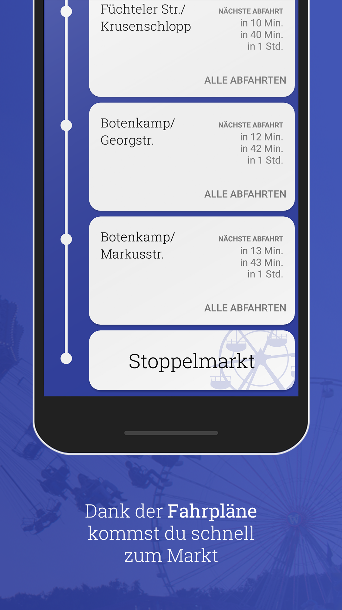
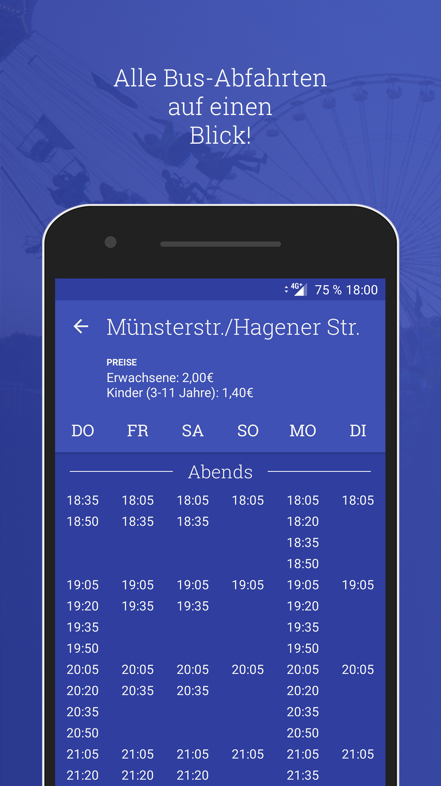
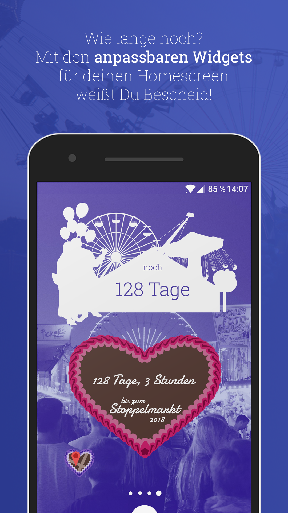
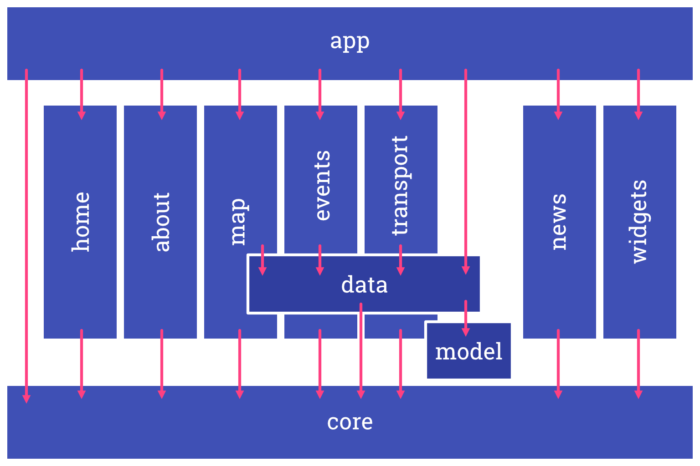

# StoppelMap

StoppelMap is an App for Android providing information about Stoppelmarkt, a funfair taking place every august in the town of Vechta in northern Germany.

In addition to a map of the area which also includes a search for stalls, marquees and fun rides, the app contains a time table for the shuttle busses as well as a schedule for events. For users to be updated about any news, a feed of articles from the official website is also shown, with any new article trigger a push notification.

[](https://play.google.com/store/apps/details?id=com.jonasgerdes.stoppelmap)

|  |            |      |
| ----------------------------------------------------------------------------------------- | --------------------------------------------------------------------------------------------- | ------------------------------------------------------------------------------- |
|  |  |  |
|                                                                                           |            |                                                                                 |

## Build

Since the project uses firebase for push notifications, first you need to [create a project in firebase](https://firebase.google.com/docs/android/setup#create-firebase-project), [download the config file](https://support.google.com/firebase/answer/7015592#android) and place it as `google-services.json` into the `app` folder.

Before building the actual app, a preparation script has to be executed by running

```sh
./gradlew runPreparation
```

which will process the GeoJSON file in `preparation/src/main/resources/map`, copy it to the assets folder of the app, create a database file and fill it with data for events, busschedules and information about the stalls read from the GeoJSON file.
This is done to keep the data in a handy format which can also be managed in git.

After the preparation, a debug version of the app can be build and installed on a connected device or emulator by running

```sh
./gradlew installDebug
```

## Architecture

The project is splitted into modules by feature, while some additional modules contain common logic, interfaces and/or data classes.
A `core` modules provides base classes as well as base interfaces needed by every feature. Everything comes together in the `app` module, which represents the actual app.

For simplicity, the additional `androidutil` module isn't shown here as most modules depend on it. Modules for testing (`testutil`, `datastub`) and preparation (`preparation`) are also omitted in this overview.

Features usually are splitted into a `view` and a `usecase` package. While `view` contains the feature's Fragment(s) and ViewModel(s) (in the Android JetPack meaning), `usecase` contains command-pattern-like classes which can execute a single usecase.

Any usecases a ViewModel needs is injected into it. The ViewModel reacts to events triggered by the view and executes suitable usecases, which run their business logic and make use of Services and Repositories they got injected.
